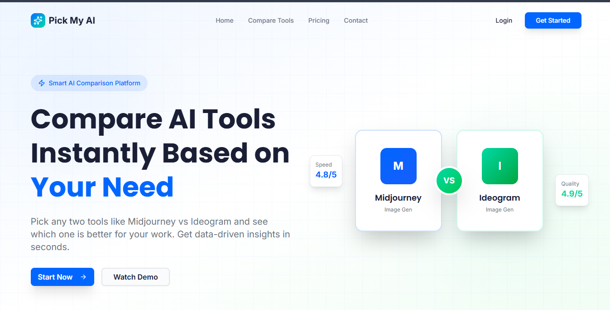

<div align="center">

# 🤖 Pick My AI

### 🚀 Discover the Best AI Tools in One Place

<p>
Find, compare and explore the latest AI tools for developers, designers, students, creators and businesses.
</p>

<p>

<a href="https://pickmyai.vercel.app/">

</a>


</p>

</div>

---

# 📖 About

**Pick My AI** is a modern web platform that helps users discover the best Artificial Intelligence tools from different categories.

Whether you're a Developer, Student, Designer, Marketer or Content Creator, Pick My AI makes it easy to find the perfect AI tool for your workflow.

---

# ✨ Features

- 🔍 Search AI Tools
- 🤖 AI Categories
- ⚡ Fast Performance
- 📱 Fully Responsive
- 🎨 Beautiful UI
- 🌙 Dark Theme
- 🚀 Smooth User Experience
- 🔥 Regular Updates

---

# 🛠 Tech Stack

| Frontend | Tools |
|-----------|--------|
| HTML5 | Git |
| CSS3 | GitHub |
| JavaScript | VS Code |
| Responsive Design | Vercel |

---

# 📂 Project Structure

```text
Pick-My-AI
│
├── assets/
├── css/
├── images/
├── js/
├── index.html
├── about.html
├── contact.html
└── README.md
```

---

# 📸 Preview

> Add your project screenshots here.

## Homepage



---

# 🚀 Live Demo

### 🌐 Website

https://pickmyai.vercel.app/

---

# 👨‍💻 Developed By

## Vipul Bariya

💻 Full Stack Web Developer

🛡 Cybersecurity Learner

🤖 AI Enthusiast

---

# 🌐 Connect With Me

<p>

<a href="https://github.com/vipulbariya-code">

</a>

<a href="https://www.linkedin.com/in/vipulbariya/">

</a>

<a href="https://www.instagram.com/vipul._x07">

</a>

<a href="https://vipulbariya.netlify.app/">

</a>

</p>

---

# ⭐ Support

If you like this project,

please leave a ⭐ Star on this repository.

It really motivates me to build more awesome projects.

---

<div align="center">

## ❤️ Thanks for Visiting

Made with ❤️ by **Vipul Bariya**

</div>
